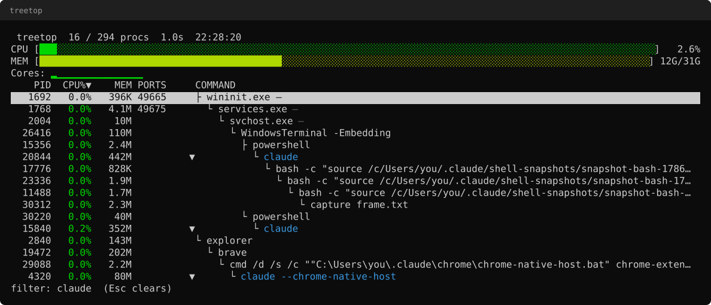

# treetop

A terminal process-tree monitor for Windows, for people who run coding
agents.



## The problem

I run Claude Code on Windows most days, and every session leaves a trail.
The agent starts a shell, the shell starts a dev server, the dev server
starts a file watcher, and twenty minutes later Task Manager shows me a
dozen entries called `node.exe` with no way to tell which one is which.
Then my next `npm run dev` fails on a port already in use, and nothing
in that list of identical entries tells me which one is holding it.

Task Manager has no process tree and no command line. `netstat -ano`
gives you a PID and nothing else — you still have to go look that PID up.
Process Explorer has both, but it's a separate GUI window you alt-tab to,
not something sitting in the terminal next to the agent that made the
mess. None of them know what an "agent session" is, so none of them can
answer the one question I actually have: what did this thing spawn, and
what did it forget to clean up?

## What it does

treetop draws the live process tree in your terminal, subtree CPU and
memory rolled up onto each root. It shows the full command line, not
just the image name, and attributes listening TCP ports to the process
holding them. It recognises common coding agents by image name or by
argument — several run as plain `node.exe`, with the agent's identity
only in `argv` — and groups each one's whole subtree into a session. One
key, `a`, narrows the screen to just those sessions plus anything left
running with no parent, which is usually the two things you came to
look at.

## Why not just use Task Manager

|                        | Task Manager | treetop |
|------------------------|--------------|---------|
| Process tree           | Flat list, no parent/child view | Full tree, collapsible, subtree CPU/mem rolled up |
| Command line            | Not shown | Full command line, shortened intelligently |
| Listening ports         | Not shown without opening Resource Monitor | Attributed to the owning process directly |
| "What did my agent spawn" | Unanswerable — no concept of a session | One key: agent sessions and orphans, nothing else |
| Orphan detection        | None | Flags processes left running with no parent, qualified so it isn't noise |
| Where it lives          | A separate window you alt-tab to | The terminal, next to the agent |
| Kill a whole subtree    | One process at a time | One key, with a confirmation listing what dies |

## Install

```
irm https://github.com/risk-alt/treetop/releases/latest/download/treetop.exe -OutFile treetop.exe
Move-Item treetop.exe $env:LOCALAPPDATA\Microsoft\WindowsApps\
treetop
```

That's the short version, and it skips two things that will trip you up
the first time: the SmartScreen warning on an unsigned `.exe`, and the
font your terminal needs to render the tree correctly. Both are covered,
along with building from source, in **[docs/install.md](docs/install.md)**.

## Keys

| Key | Action |
|---|---|
| `↑` `↓` | Move selection |
| `←` `→` / `Space` | Collapse / expand |
| `a` | Agents-only view: sessions and orphans, nothing else |
| `o` | Orphans-only view |
| `/` | Incremental filter over image name and command line |
| `Esc` | Clear filter |
| `F5` | Toggle tree / flat view |
| `F6`, `<`, `>` | Cycle sort column |
| `F9` | Kill selected process, with confirmation |
| `Shift+F9` | Kill entire subtree, confirmation lists what dies |
| `p` | Pause refresh |
| `+` `-` | Adjust refresh interval |
| `F1` / `?` | Help overlay |
| `q`, `Ctrl+C` | Quit |

## `--json`

`treetop --json` samples the process table twice (so CPU percentages are
real, not zero) and prints one snapshot to stdout:

```json
{
  "version": "0.1.0",
  "sampled_at": "2026-08-09T13:42:07Z",
  "system": { "cores": 16, "cpu_pct": 4.8, "mem_total": 33999998976, "mem_used": 11815426048 },
  "sessions": [
    { "label": "Claude Code", "pid": 20844, "cpu_pct": 1.4, "mem": 438272000, "process_count": 6 }
  ],
  "orphans": [
    { "pid": 40221, "image": "node.exe", "cmdline": "node vite dev --host", "ports": [5173], "cpu_pct": 0.0, "mem": 61865984 }
  ],
  "processes": [
    { "pid": 20844, "ppid": 15356, "image": "claude.exe", "cmdline": "\"C:\\Users\\you\\.local\\bin\\claude.exe\"", "cpu_pct": 1.4, "mem": 438272000, "threads": 24, "ports": [], "orphan": false, "agent_root": true, "agent_label": "Claude Code" }
  ]
}
```

`sessions` and `orphans` are the two questions this flag exists to
answer, so they're pulled out separately rather than making a consumer
reconstruct the tree from `processes` to find them. An agent that wants
to clean up after itself before exiting can do this:

```
$ treetop --json | jq '.orphans[] | {pid, image, ports}'
{
  "pid": 40221,
  "image": "node.exe",
  "ports": [5173]
}
$ taskkill /PID 40221 /F
```

This shape is treated as a stable interface from the first tagged
release on.

## Adding an agent

Agent recognition is one table, [`src/agent/rules.c`](src/agent/rules.c):

```c
static const t_agent_rule  g_agent_rules[] = {
    { L"claude",    MATCH_IMAGE | MATCH_CMDLINE, L"Claude Code" },
    { L"cursor",    MATCH_IMAGE,                 L"Cursor"      },
    ...
    { L"amp",       MATCH_CMDLINE,               L"Amp"         },
};
```

Adding one is a one-line diff:

```diff
     { L"amp",       MATCH_CMDLINE,               L"Amp"         },
+    { L"mytool",    MATCH_IMAGE | MATCH_CMDLINE, L"My Tool"     },
 };
```

`MATCH_CMDLINE` matters whenever the agent runs as a bare `node.exe` or
`python.exe` with its own name only showing up in `argv`; `MATCH_IMAGE`
is enough when the binary itself is named after the tool. If your agent
isn't recognised, a pull request adding one line here is welcome.

## Building from source

```
cmake -S . -B build -DCMAKE_BUILD_TYPE=Release
cmake --build build --config Release
ctest --test-dir build -C Release --output-on-failure
```

Prerequisites and troubleshooting: **[docs/install.md](docs/install.md)**.

## Known limitations

- Command lines of protected and other-user processes are unreadable
  without elevation. This is a Windows security boundary, not a bug.
- No per-process disk or network I/O. Getting these reliably requires
  ETW, which is a project of its own.
- UDP listeners are not shown; only TCP.
- Windows 10 build 1809 or later. Earlier builds lack reliable VT
  support.
- Agent detection is pattern-based. An agent invoked in an unusual way
  may not be recognised — the rule table is one line per entry and takes
  a pull request.

## Licence

MIT. See [LICENSE](LICENSE).
